# 📊 Customer Churn Prediction Using Machine Learning

An end-to-end **Machine Learning project for predicting customer churn in the telecommunications industry**.  
The goal is to identify customers who are likely to leave a service so companies can take proactive retention actions.

This project follows the **CRISP-DM framework** and evaluates multiple machine learning models including **XGBoost, Random Forest, CatBoost, and ensemble voting models** to maximize churn detection.

---

## 🚀 Project Overview

Customer churn prediction is a critical application of **machine learning in business analytics**.  
In telecom companies, **retaining existing customers is significantly cheaper than acquiring new ones**.

This project builds a **predictive model that identifies customers with a high probability of leaving the service**, enabling targeted retention strategies.

### **Key Objective**

Maximize **Recall** to ensure the model detects as many churners as possible.

---

## 📂 Dataset

The project uses the **Telco Customer Churn dataset (Kaggle)** containing information about approximately **7,000 telecom customers**.

### **Features include**

#### **Demographics**
- Gender
- Senior citizen
- Partner / dependents

#### **Services**
- Phone service
- Internet service (DSL / Fiber)
- Streaming services
- Tech support

#### **Account Information**
- Tenure
- Contract type
- Payment method
- Monthly charges

### **Target Variable**
Churn = Yes / No

---

## 📊 Target Distribution

The dataset is **imbalanced**, with churners representing roughly **26% of customers**.

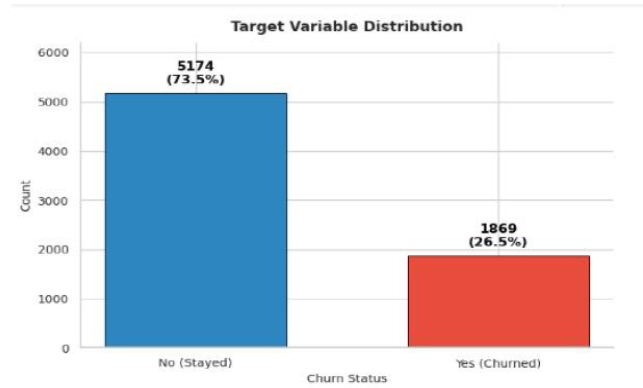

This imbalance was handled during training using **class weighting and `scale_pos_weight`**.

---

## 🔍 Exploratory Data Analysis (EDA)

Exploratory analysis helped identify **key patterns influencing customer churn**.

### **Contract Type vs Churn**

Customers with **month-to-month contracts churn significantly more** than customers with long-term contracts.

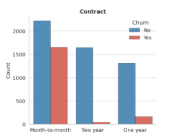

---

### **Tenure vs Churn**

New customers (**0–12 months**) are significantly more likely to churn.

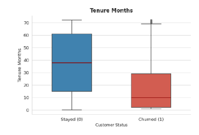

---

### **Internet Service vs Churn**

Customers using **fiber optic internet services** show higher churn rates compared to DSL users.
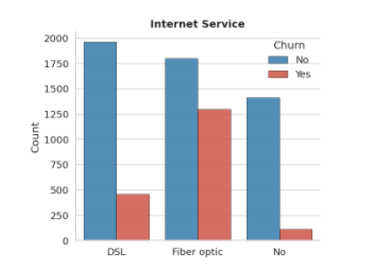

---

## 📈 Feature Relationships

Correlation analysis was performed to identify relationships between **numerical features**.

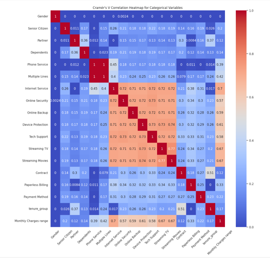

### **Key Observations**

- **Tenure and total charges show strong correlation**
- Longer customer relationships usually lead to higher spending.

---

## 🛠 Data Preparation

Data preprocessing steps included:

- Removing **non-informative features** (CustomerID)
- Handling **missing values**
- Converting **categorical variables**
- Feature engineering
- Addressing **class imbalance**

### **Feature Engineering**

New features were created to better capture **customer lifecycle behavior**:

- **Tenure groups**
- **Monthly charge ranges**

### **Categorical Encoding**

**Weight of Evidence (WOE encoding)** was applied to transform categorical features into numerical representations suitable for modeling.

---

## 🤖 Machine Learning Models

Several machine learning models were trained and evaluated:

| Model | Description |
|------|-------------|
| **XGBoost** | Gradient boosting algorithm optimized for tabular data |
| **Random Forest** | Ensemble tree-based model |
| **CatBoost** | Gradient boosting model optimized for categorical features |
| **Voting Ensemble** | Combination of multiple models |

### **Training Procedure**

- **5-Fold Stratified Cross Validation**
- **RandomizedSearchCV for hyperparameter tuning**

---

## 📉 ROC Curve

The **ROC curve** illustrates the tradeoff between the **true positive rate and false positive rate**.

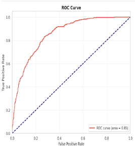

The best model achieved **ROC-AUC ≈ 0.85**.

---

## 📊 Precision–Recall Curve

Precision–Recall analysis is particularly important for **imbalanced datasets**.

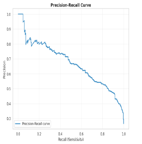

---

## 📊 Model Comparison

The table below compares the performance of the evaluated models.

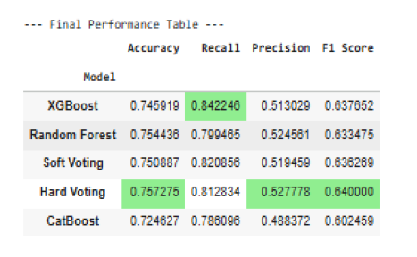

---

## 📉 Model Stability Across Cross-Validation

To ensure the model generalizes well, we evaluated **training and validation recall across 5-fold cross-validation**.

The small gap between training and validation recall (~4.75%) indicates **minimal overfitting and stable performance**.

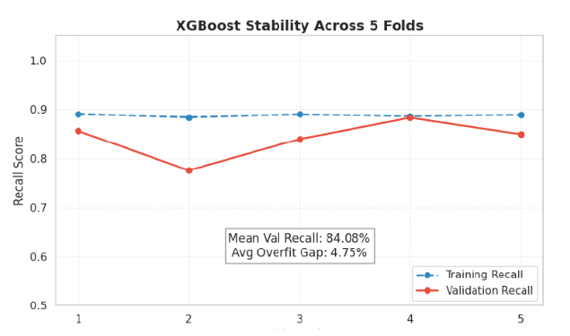

---

## 🧩 Best Model Detailed Performance

The following figure shows the **classification report and confusion matrix of the best performing model (XGBoost)**.

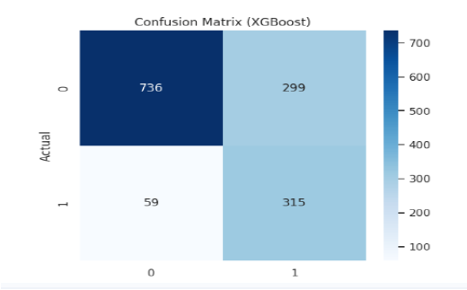

---

## 🏆 Model Performance

**Best performing model: XGBoost**

| Metric | Score |
|------|------|
| **Accuracy** | ~0.75 |
| **Recall** | **84.22%** |
| **Precision** | ~0.51 |
| **ROC-AUC** | ~0.85 |

The model successfully identifies **more than 84% of churners**, making it highly valuable for **customer retention strategies**.

---

## 📊 Feature Importance

Feature importance analysis highlights the **main factors driving customer churn**.

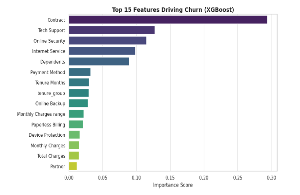

### **Top Predictors**

1. **Contract type**
2. **Tenure months**
3. **Tech support availability**
4. **Internet service (fiber optic)**

These insights align strongly with findings from **exploratory analysis**.

---

## 💡 Business Recommendations

Based on the results, telecom companies can reduce churn by implementing the following strategies:

### **Encourage Long-Term Contracts**

Offer incentives for **month-to-month customers to switch to annual contracts**.

### **Improve Early Customer Experience**

Provide **enhanced onboarding programs during the first year**.

### **Promote Technical Support**

Encourage customers experiencing technical issues to use **support services**.

---

## 🧰 Technologies Used

- **Python**
- **Pandas**
- **NumPy**
- **Scikit-learn**
- **XGBoost**
- **CatBoost**
- **Matplotlib**
- **Seaborn**
- **Jupyter Notebook**

---

## 🚀 Future Improvements

Potential improvements include:

- Integrating **customer support chat sentiment analysis**
- Testing **deep learning models**
- Deploying the model as a **real-time churn prediction API**
- Building an **interactive dashboard for churn monitoring**

---

## 👤 Author

**Amar Mnaa**  
*M.Sc. Data Science Student – Ben-Gurion University*

🔗 **GitHub**  
https://github.com/AmarMnaa
